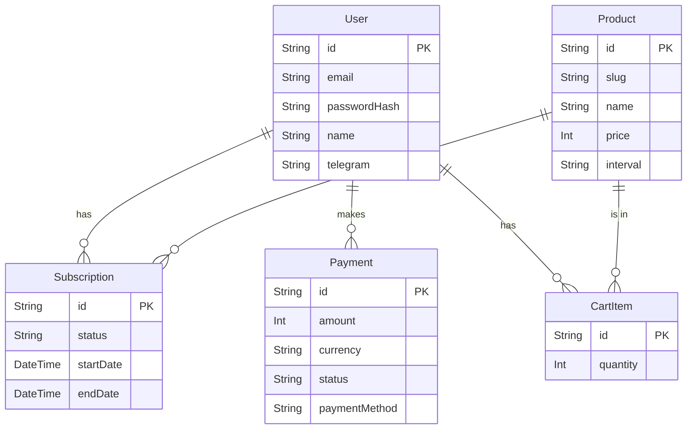

# 4. Database Schema

For data management in the project, we use **Prisma** — an ORM (Object-Relational Mapper) for the next generation for Node.js and TypeScript. As a database for local development and simple deployment, we use **PostgreSQL**.

All data schema is described in the file [`backend/prisma/schema.prisma`](../backend/prisma/schema.prisma).

## Data Models Overview

Below are the main models and their purposes.

### `User`

Represents a system user.

| Field          | Type      | Description                                |
| -------------- | --------- | ------------------------------------------ |
| `id`           | `String`  | Unique identifier (UUID).                  |
| `email`        | `String`  | Unique user email.                         |
| `passwordHash` | `String`  | Password hash generated with `bcrypt`.     |
| `name`         | `String`  | User's name.                               |
| `telegram`     | `String`  | Unique Telegram username.                  |
| `telegramId`   | `String?` | User ID in Telegram (for bot integration). |

**Relationships:**

- One `User` can have many `Subscription`, `Payment`, and `CartItem`.

### `Product`

Represents a subscription plan or product that can be purchased.

| Field         | Type      | Description                                    |
| ------------- | --------- | ---------------------------------------------- |
| `id`          | `String`  | Unique identifier (UUID).                      |
| `slug`        | `String`  | Unique URL string (e.g., `basic-plan`).        |
| `name`        | `String`  | Product name (e.g., "Basic Plan").             |
| `description` | `String`  | Product description.                           |
| `price`       | `Int`     | Price in the smallest currency unit (kopecks). |
| `interval`    | `String`  | Subscription interval ("month" or "year").     |
| `features`    | `String`  | JSON string with a list of product features.   |
| `isActive`    | `Boolean` | Is the product active for purchase.            |
| `tier`        | `Int`     | Tier level (1, 2, 3).                          |

**Relationships:**

- One `Product` can be associated with many `Subscription` and `CartItem`.

### `Subscription`

Links a user with the product they are subscribed to.

| Field             | Type        | Description                                                      |
| ----------------- | ----------- | ---------------------------------------------------------------- |
| `id`              | `String`    | Unique identifier (UUID).                                        |
| `userId`          | `String`    | ID of the user who owns the subscription.                        |
| `productId`       | `String`    | ID of the product the subscription is for.                       |
| `status`          | `String`    | Subscription status ("active", "cancelled", "expired", "trial"). |
| `startDate`       | `DateTime`  | Start date of the subscription.                                  |
| `endDate`         | `DateTime`  | End date of the subscription.                                    |
| `nextPaymentDate` | `DateTime?` | Next payment date (for recurring payments).                      |

**Relationships:**

- Belongs to one `User` and one `Product`.

### `Payment`

Record of a financial transaction.

| Field           | Type      | Description                                                   |
| --------------- | --------- | ------------------------------------------------------------- |
| `id`            | `String`  | Unique identifier (UUID).                                     |
| `userId`        | `String`  | ID of the user who made the payment.                          |
| `amount`        | `Int`     | Amount in the smallest currency unit (kopecks).               |
| `currency`      | `String`  | Payment currency ("RUB", "USD", "USDT", "TON").               |
| `status`        | `String`  | Payment status ("pending", "completed", "failed", "expired"). |
| `paymentMethod` | `String`  | Payment method (e.g., "crypto_usdt_trc20").                   |
| `walletAddress` | `String?` | Wallet address for crypto payments.                           |
| `txHash`        | `String?` | Transaction hash in the blockchain.                           |
| `qrCode`        | `String?` | QR code for payment (in Base64 format).                       |

**Relationships:**

- Belongs to one `User`.

### `CartItem`

Intermediate model for storing products in a user's cart.

| Field       | Type     | Description                             |
| ----------- | -------- | --------------------------------------- |
| `id`        | `String` | Unique identifier (UUID).               |
| `userId`    | `String` | User ID.                                |
| `productId` | `String` | Product ID in the cart.                 |
| `quantity`  | `Int`    | Quantity (usually 1 for subscriptions). |

**Relationships:**

- Belongs to one `User` and one `Product`.

## Visual Schema (ERD)

---

**Next:** [05 - Frontend](./05_Frontend.md)
