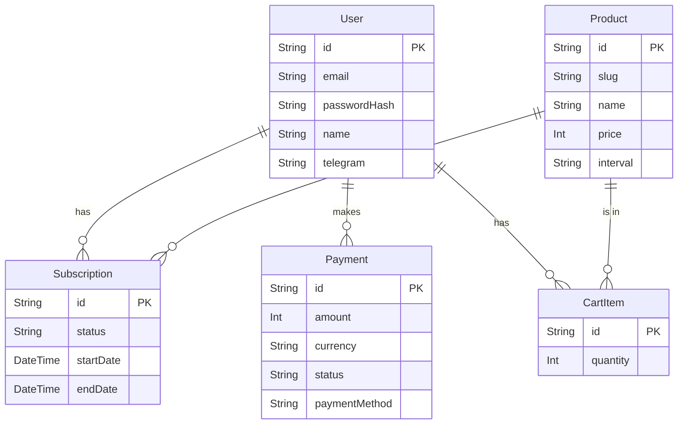

# 4. Схема базы данных

Для управления данными в проекте используется **Prisma** — это ORM (Object-Relational Mapper) нового поколения для Node.js и TypeScript. В качестве базы данных для локальной разработки и простого развертывания выбран **SQLite**.

Вся схема данных описана в файле [`backend/prisma/schema.prisma`](../backend/prisma/schema.prisma).

## Обзор моделей данных

Ниже описаны основные модели и их назначение.

### `User` (Пользователь)

Представляет пользователя системы.

| Поле           | Тип       | Описание                                             |
| -------------- | --------- | ---------------------------------------------------- |
| `id`           | `String`  | Уникальный идентификатор (UUID).                     |
| `email`        | `String`  | Уникальный email пользователя.                       |
| `passwordHash` | `String`  | Хеш пароля, сгенерированный с помощью `bcrypt`.      |
| `name`         | `String`  | Имя пользователя.                                    |
| `telegram`     | `String`  | Уникальный юзернейм в Telegram.                      |
| `telegramId`   | `String?` | ID пользователя в Telegram (для интеграции с ботом). |

**Связи:**

- Один `User` может иметь много `Subscription`, `Payment` и `CartItem`.

### `Product` (Продукт)

Представляет тарифный план или продукт, который можно купить.

| Поле          | Тип       | Описание                                            |
| ------------- | --------- | --------------------------------------------------- |
| `id`          | `String`  | Уникальный идентификатор (UUID).                    |
| `slug`        | `String`  | Уникальная строка для URL (например, `basic-plan`). |
| `name`        | `String`  | Название продукта (например, "Базовый тариф").      |
| `description` | `String`  | Описание продукта.                                  |
| `price`       | `Int`     | Цена в копейках (для избежания проблем с float).    |
| `interval`    | `String`  | Интервал подписки ("month" или "year").             |
| `features`    | `String`  | JSON-строка со списком фич продукта.                |
| `isActive`    | `Boolean` | Активен ли продукт для покупки.                     |
| `tier`        | `Int`     | Уровень тарифа (1, 2, 3).                           |

**Связи:**

- Один `Product` может быть связан с многими `Subscription` и `CartItem`.

### `Subscription` (Подписка)

Связывает пользователя с продуктом, на который он подписан.

| Поле              | Тип         | Описание                                                     |
| ----------------- | ----------- | ------------------------------------------------------------ |
| `id`              | `String`    | Уникальный идентификатор (UUID).                             |
| `userId`          | `String`    | ID пользователя, которому принадлежит подписка.              |
| `productId`       | `String`    | ID продукта, на который оформлена подписка.                  |
| `status`          | `String`    | Статус подписки ("active", "cancelled", "expired", "trial"). |
| `startDate`       | `DateTime`  | Дата начала подписки.                                        |
| `endDate`         | `DateTime`  | Дата окончания подписки.                                     |
| `nextPaymentDate` | `DateTime?` | Дата следующего списания (для рекуррентных платежей).        |

**Связи:**

- Принадлежит одному `User` и одному `Product`.

### `Payment` (Платеж)

Запись о финансовой транзакции.

| Поле            | Тип       | Описание                                                      |
| --------------- | --------- | ------------------------------------------------------------- |
| `id`            | `String`  | Уникальный идентификатор (UUID).                              |
| `userId`        | `String`  | ID пользователя, совершившего платеж.                         |
| `amount`        | `Int`     | Сумма в копейках.                                             |
| `currency`      | `String`  | Валюта платежа ("RUB", "USD", "USDT", "TON").                 |
| `status`        | `String`  | Статус платежа ("pending", "completed", "failed", "expired"). |
| `paymentMethod` | `String`  | Метод оплаты (например, "crypto_usdt_trc20").                 |
| `walletAddress` | `String?` | Адрес кошелька для крипто-платежей.                           |
| `txHash`        | `String?` | Хеш транзакции в блокчейне.                                   |
| `qrCode`        | `String?` | QR-код для оплаты (в формате Base64).                         |

**Связи:**

- Принадлежит одному `User`.

### `CartItem` (Элемент корзины)

Промежуточная модель для хранения продуктов в корзине пользователя.

| Поле        | Тип      | Описание                            |
| ----------- | -------- | ----------------------------------- |
| `id`        | `String` | Уникальный идентификатор (UUID).    |
| `userId`    | `String` | ID пользователя.                    |
| `productId` | `String` | ID продукта в корзине.              |
| `quantity`  | `Int`    | Количество (обычно 1 для подписок). |

**Связи:**

- Принадлежит одному `User` и одному `Product`.

## Визуальная схема (ERD)

---

**Далее:** [05 - Фронтенд](./05_Frontend.md)
